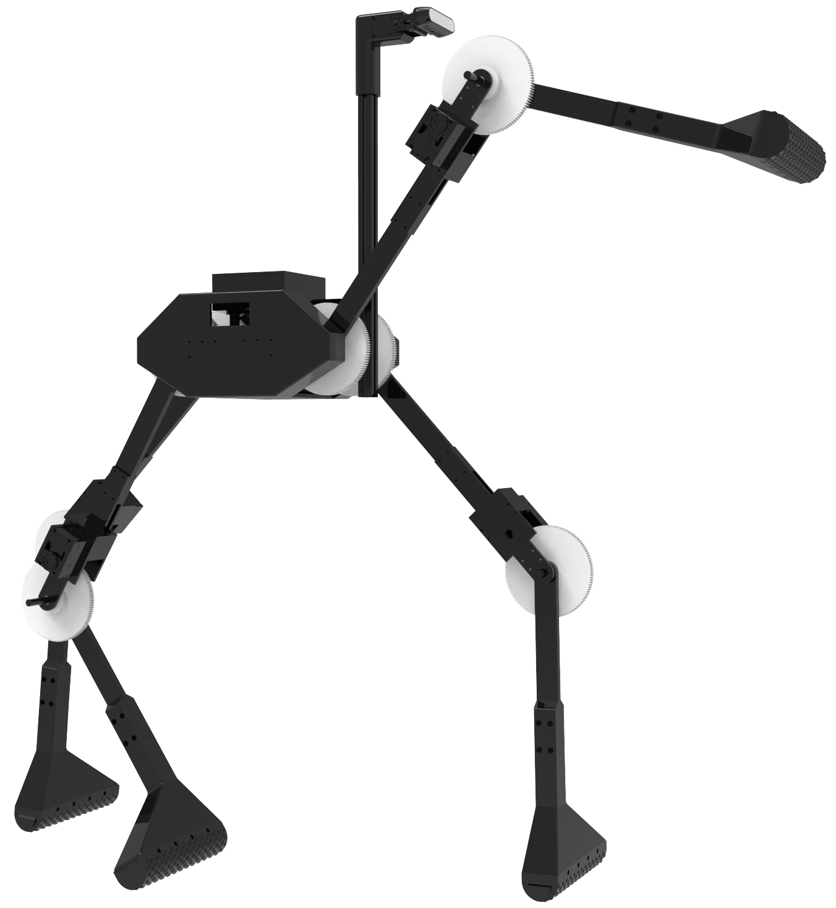
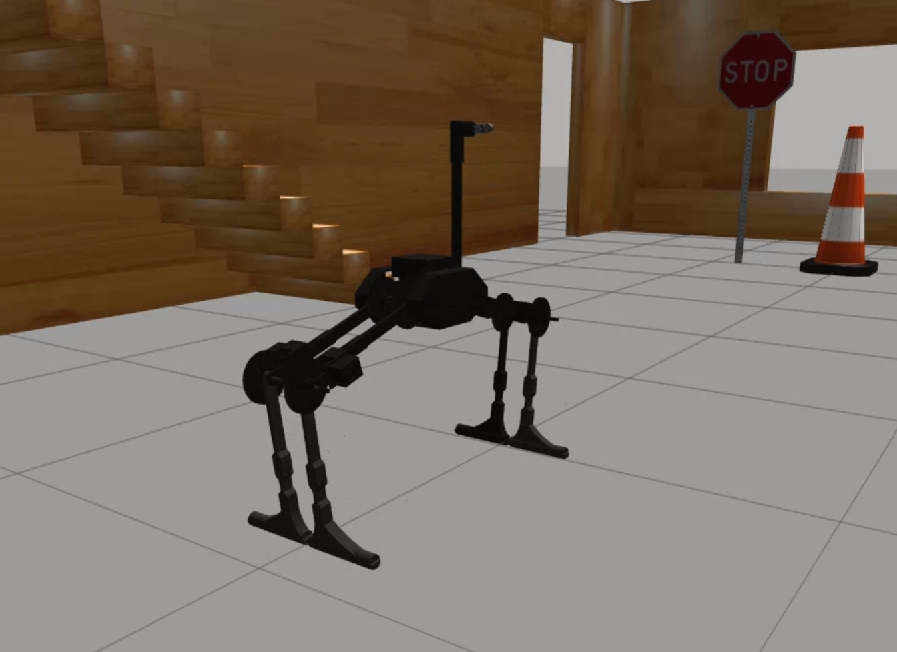
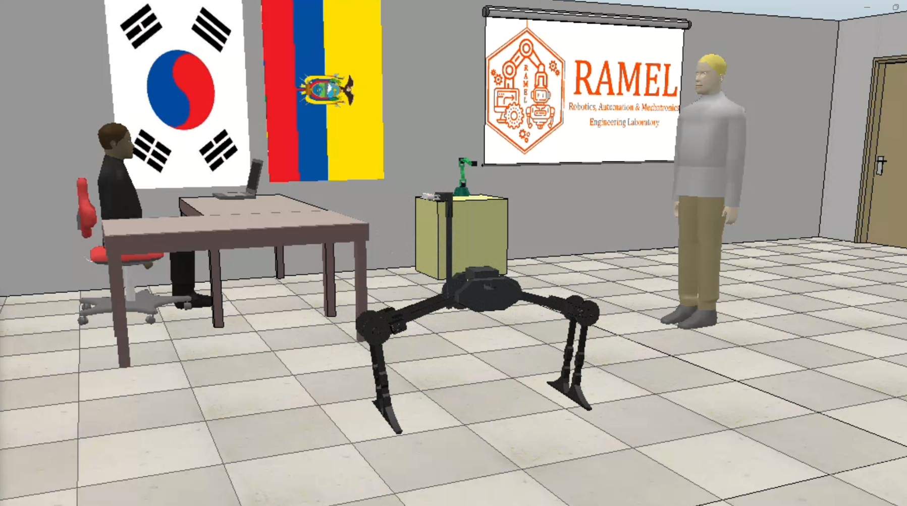

# Sistema de Control de Movimiento para Robot Cuadrúpedo (ROS2 Humble)

  

## Descripción del Proyecto

Este proyecto es parte de una tesis titulada **"Diseño e Implementación de un Sistema de Control de Movimiento para Robot Cuadrúpedo"**, desarrollado por **Erick Mendoza** y **Juan Saeteros**. El objetivo principal es implementar un sistema de control para un robot cuadrúpedo con 8 grados de libertad (2 DOF por pata) y un motor adicional para controlar una cámara montada en la cabeza del robot.

El robot es capaz de:
- Caminar hacia adelante y hacia atrás.
- Mover el centro del robot vertical y horizontalmente.
- Rotar el centro del robot para ajustarse a distintas posiciones.
- Mantener posiciones específicas mientras se mueve.
- Utilizar una cámara para monitorear el entorno y un motor adicional para ajustar su ángulo.

El proyecto está desarrollado en **ROS2 Humble**, utilizando **Gazebo Classic 11** y **V-REP** para simulaciones, y se puede controlar mediante una interfaz gráfica o un mando de PS4.

---


## Estructura del Repositorio

```
quadruped_ros2/
├── quadruped_description/       # Archivos URDF y de descripción del robot
├── quadruped_master/            # Nodos principales de movimiento del sistema
├── quadruped_communication/     # Comunicación con motores Dynamixel y simulacion en VREP
├── quadruped_app/               # Codigo implementado para la interfaz
├── quadruped_interfaces/        # Tipos de mensajes creados para controlar el movimiento
├── README.md                    # Este archivo
└── ...
```

## Arquitectura del Sistema
El sistema está diseñado con una arquitectura modular que facilita la integración y pruebas de cada componente. Los módulos principales son:

1. **`interface_node`**: Responsable de la interacción con el usuario y la configuración de parámetros.
2. **`movement_node`**: Realiza cálculos cinemáticos para determinar la posición de las articulaciones en función de los parámetros requeridos.
3. **`dynamixel_communication_node`**: Envía comandos a los actuadores físicos del robot basándose en los datos generados por el `movement_node`.
4. **`write_motor_data`**: Registra y transmite en tiempo real la información del estado del robot (posiciones de los joints, parámetros del sistema, etc.).
5. **`image_node`**: Visualiza la cámara en la interfaz, tanto en simulaciones (Gazebo/V-REP) como en el robot real.
6. **`visualizer_node`**: Muestra los ángulos actuales de las articulaciones del robot utilizando `matplotlib`.

---

## Instalación

### Dependencias
- **ROS2 Humble**: Asegúrate de tener ROS2 Humble instalado en tu sistema.
- **Gazebo Classic 11**: Para simulaciones en Gazebo.
- **V-REP**: Para simulaciones en V-REP.
- **Dynamixel SDK**: Para controlar los motores Dynamixel del robot.

### Pasos de Instalación
1. Clona el repositorio en tu espacio de trabajo de ROS2:
   ```bash
   git clone https://github.com/M4V3R1CK100/quadruped_ros2.git
   cd quadruped_ros2
   ```
2. Instala las dependencias necesarias para el proyecto:
   ```bash
   sudo apt-get install ros-humble-gazebo-ros-pkgs ros-humble-joy
   ```
3. Construye el paquete:
   ```bash
   colcon build --symlink-install
   ```
4. Fuente el entorno:
   ```bash
   source install/setup.bash
   ```

---


### Compila el paquete

Para compilar el paquete y preparar el entorno, sigue estos pasos:

```bash
colcon build
source install/setup.bash
```

### Instala las dependencias adicionales

Una vez que hayas compilado el paquete, asegúrate de instalar las dependencias adicionales que pueda necesitar el proyecto:

```bash
rosdep install --from-paths src --ignore-src -r -y
```

---

## Uso

### Simulación en Gazebo

1. **Lanza la simulación en Gazebo**:
   ```bash
   ros2 launch quadruped_description simulation.launch.py
   ```

2. **Inicia el sistema de movimiento**:
   ```bash
   ros2 launch quadruped_master gazebo_movement.launch.py
   ```

---
  


### Simulación en V-REP

1. **Abre la escena en V-REP**:
   ```bash
   ./CoppeliaSim.sh /home/user/quad_ws/src/quadruped_communication/scenes/quadruped_ramel_black.ttt
   ```

2. **Lanza el sistema de movimiento**:
   ```bash
   ros2 launch quadruped_master vrep_movement.launch.py
   ```

  

---

### Robot Real

1. **Inicia la comunicación con los motores Dynamixel**:
   ```bash
   ros2 run quadruped_communication u2d2_communication.py
   ```

2. **Lanza el sistema de movimiento**:
   ```bash
   ros2 launch quadruped_master real_movement.launch.py
   ```

  
---

### Control

El robot puede controlarse de dos maneras:

- **Interfaz gráfica**: Este es el modo predeterminado.
- **Mando de PS4**: Para habilitar este modo, añade el argumento `joy_arg:=true` al lanzar el sistema de movimiento:
  
  ```bash
  ros2 launch quadruped_master real_movement.launch.py joy_arg:=true
  ```

---

### Demostración

Aquí puedes ver un video de la caminata del robot y las simulaciones:  
[Video de Demostración]  

---
